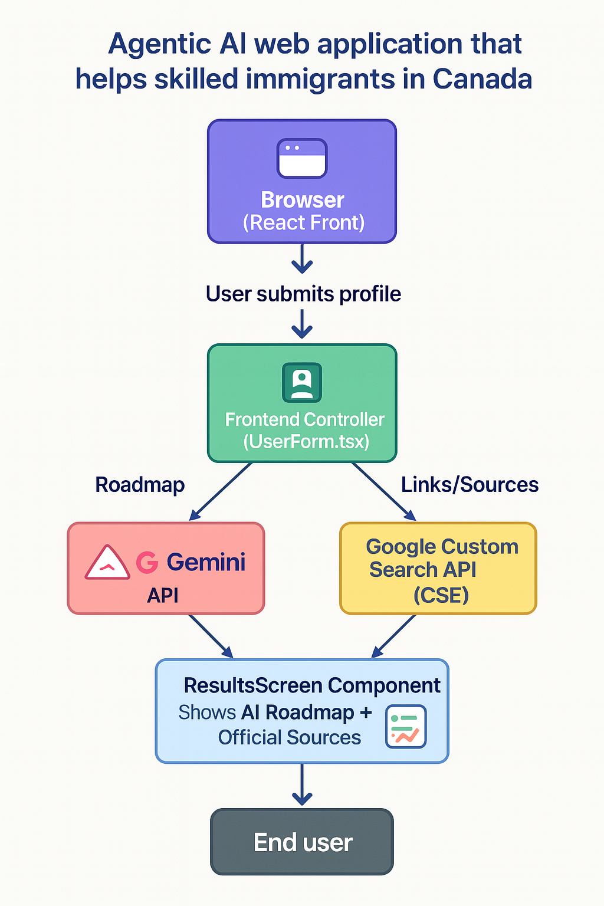

## 2. `ARCHITECTURE.md`

This project is an **Agentic AI web application** that helps skilled immigrants receive a personalized roadmap for validating and launching their careers in Canada. The system leverages Google Gemini for reasoning and text generation, and Google Custom Search API for real-time source verification and up-to-date links.

# Architecture Overview

## Components:

### 1. **User Interface**
 **Browser (React Front)** | Vite + React + Tailwind (shadcn) | Hosts the interactive wizard; runs fully client‑side. |

### 2. **Agent Core**
| Part | Implementation | Role |
|------|----------------|------|
| **Planner** | Prompt‑engineering inside `route.ts` | Builds a structured prompt (profile + JSON schema), instructs Gemini. |
| **Executor** | Next.js API Route (`app/api/generate-roadmap/route.ts`) | Calls Gemini **and** Google CSE, merges results, returns JSON. |

### 3. **Tools / APIs**
| Tool | Why |
|------|-----|
| **Gemini API (2.5 / 2.0‑flash)** | Generates the personalized roadmap in strict JSON. |
| **Google Custom Search API (CSE)** | Provides fresh web snippets / links for citations. |
